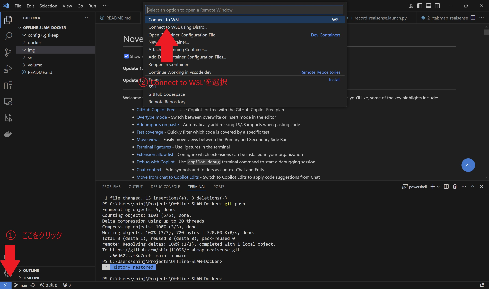
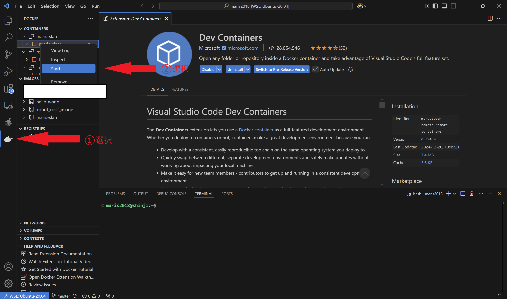
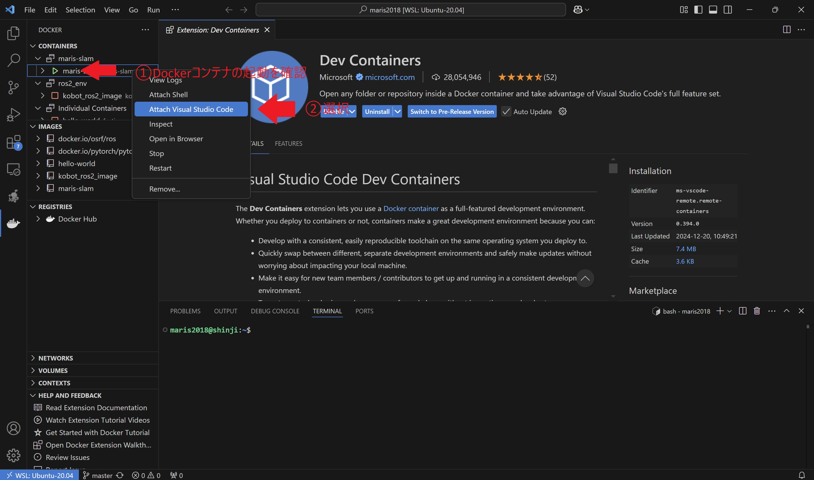
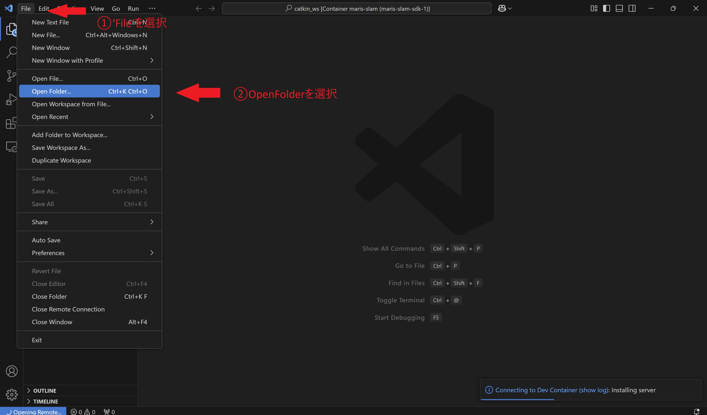

# RTAB-SLAM-DOCKER
Docker環境でROS2を使い,RTAB-SLAMを実行するためのパッケージです．
Windows上でWSL2上にDockerをインストールしていることを前提にしています．

# 目次

- [RTAB-SLAM-DOCKER](#rtab-slam-docker)
- [目次](#目次)
- [1. 実行環境](#1-実行環境)
- [2. パッケージ概要](#2-パッケージ概要)
  - [2.1 フォルダ構成](#21-フォルダ構成)
  - [2.2 フォルダ説明](#22-フォルダ説明)
- [3. WSL2環境設定](#3-wsl2環境設定)
- [4. Dockerコンテナの操作](#4-dockerコンテナの操作)
- [5. データ収集](#5-データ収集)
  - [5.1 前準備](#51-前準備)
  - [5.2 データ収集手順](#52-データ収集手順)
- [6. 軌跡の記録と可視化](#6-軌跡の記録と可視化)
- [7. VSCode設定](#7-vscode設定)
  - [7.1 WSLに接続](#71-wslに接続)
  - [7.2 Dockerコンテナをアタッチ](#72-dockerコンテナをアタッチ)
  - [7.3 プロジェクトを開く](#73-プロジェクトを開く)
- [✅TODO](#todo)
- [📒参考文献](#参考文献)

# 1. 実行環境

| 環境 | バージョン |
| ---- | ---- |
| Host OS | Windows 11 Home |
| Gest OS | Ubuntu 22.04 LTE |
| WSL2 | TBD |
| Docker | TBD |
| Base Image | ros:humble-perception |
| ROS | ROS 2 Humble |

# 2. パッケージ概要

## 2.1 フォルダ構成

```shell
├── config/
├── docker/
    ├── Dockerfile
    └── docker-compose.yaml
├── img/
├── src/
    └── scripts
├── volume/
└── README.md
```

## 2.2 フォルダ説明

| フォルダ名 | 役割 |
| ---- | ---- |
| config | 設定ファイル管理 |
| dokcer | dockerファイル管理 |
| img | README.mdで使用する画像 |
| src | ros2自作パッケージのソースコード管理 |
| volume | dockerの永続化データ保存用 |


# 3. WSL2環境設定

0. **realsenseがPCに接続されていないことを確認**

1. **librealsenseソースコードをクローン**

```shell
$ git clone https://github.com/IntelRealSense/librealsense && cd librealsense
```
2. **udevルールの変更**

```shell
$ sudo chmod +x ./scripts/setup_udev_rules.sh
$ ./scripts/setup_udev_rules.sh
```

3. **realsense接続先の確認**
```shell
$ v4l2-ctl --list-devices

----------- 以下のような出力ならOK --------------
Intel(R) RealSense(TM) Depth Ca (usb-0000:00:14.0-2):
	/dev/video4
	/dev/video5
	/dev/video6
	/dev/video7
	/dev/video8
	/dev/video9
	/dev/media2
	/dev/media3

 HD Webcam: HD Webcam (usb-0000:00:14.0-6):
	/dev/video0
	/dev/video1
	/dev/video2
	/dev/video3
	/dev/media0
	/dev/media1
------------------------------------------------
```

4. **docker-compose.yamlの修正**
ホストPC上のデバイス割り当てをdockerコンテナにも反映させるために，`docker-compose.yaml`を修正する．

**step1 上記コマンドの出力結果を確認する**
**step2 `docker-compose.yaml`の`devices`属性を確認**
**step3 全ての割り当てが記述されていることを確認**
**step4 記述漏れがあれば追加する**

```shell:例.sh
(上記の場合この状態なら問題ない）
    devices:
      - /dev/video0:/dev/video0
      - /dev/video1:/dev/video1
      - /dev/video2:/dev/video2
      - /dev/video3:/dev/video3
      - /dev/video4:/dev/video4
      - /dev/video5:/dev/video5
      - /dev/video6:/dev/video6
      - /dev/video7:/dev/video7
      - /dev/video8:/dev/video8
      - /dev/video9:/dev/video9
      - /dev/media2:/dev/media0
      - /dev/media3:/dev/media1
      - /dev/media2:/dev/media2
      - /dev/media3:/dev/media3
```


# 4. Dockerコンテナの操作

1.  **dockerイメージのビルド**

```shell
$ docker build --build-arg ROS_DISTRO=humble -t realsense-ros2-humble .
```

2.  **dockerコンテナの立ち上げ**

```shell
docker compose up -d
```

3. **dockerコンテナの終了**
**作業が終わりコンテナを終了する場合**は以下のコマンドを実行する．

```shell
docker compose down
```

# 5. データ収集

## 5.1 前準備

1. **記憶媒体の用意**
出力されるbagファイルは非常に大きくなるため（数十秒の記録で1-2GBほど）USB，SSDなど別途記憶媒体を用意する

2. **記録保存先の確認**
`docker-compose.yaml`を開き`volumes`属性を確認
```shell
    volumes:
      - /tmp/.X11-unix:/tmp/.X11-unix
      - ./src:/ros2_ws/src
      - ./volume/bag:../bag <- ###これが記録保存先 （ホストOS側フォルダ:docker側フォルダ）###
```

3. **volumeの変更**
以下を適切に変更して記録先を変更する

```shell
例：D:/data/bagに保存する場合
    volumes:
      - /tmp/.X11-unix:/tmp/.X11-unix
      - ./src:/ros2_ws/src
      - D:/data/bag:../bag
```

## 5.2 データ収集手順

1. **コンテナのアタッチ**
[7. Dockerコンテナでの作業手順](#7-dockerコンテナでの作業手順)に従ってコンテナのアタッチまで行う

2. **Realsense D435iの接続を確認**
下のコマンドでRealsense D435iが接続されていることを確認する．

```shell
$ v4l2-ctl --list-device
Intel(R) RealSense(TM) Depth Ca (usb-0000:00:14.0-2):
	/dev/video2
	/dev/video3
	/dev/video4
	/dev/video5
	/dev/video6
	/dev/video7

Integrated_Webcam_HD: Integrate (usb-0000:00:14.0-5):
	/dev/video0
	/dev/video1
```

3. **データ収集プログラムの実行**
`output_filename`で出力ファイル名を変更する．
```shell
###############

output_filename = "sample1.bag"　<- sample1.bagが保存される

###############
```
下記コマンドでデータ収集プログラムを実行する．

```shell
ros2 launch rtab_realsense 1_record_realsense.launch.py
```

4. **収集プログラムの終了**

データ収集プログラムは`Ctrl + C`で終了する．

# 6. 軌跡の記録と可視化

1. **軌跡の記録**
以下のコマンドによってしSLAMを実行する．

```shell
ros2 launch rtab_realsense 2_rtabmap_realsense.launch.py
```

別ターミナルを開いて以下のコマンドを実行する．
```shell
ros2 launch rtab_realsense 3_record_rtabmap.launch.py
```

2. **軌跡の可視化**
`bag_file_path`を変更して可視化するbagファイルを指定する．
```shell
###############
bag_file_path = 'sample1.bag'
###############
```

以下のコマンドを実行するとrviz上にrealsenseのポーズが表示される．
```shell
ros2 launch rtab_realsense 4_play_bag.launch.py
```

# 7. VSCode設定

## 7.1 WSLに接続

- ①画面左下のアイコンをクリック
- ②`Connect to WSL`を選択し，リモートウィンドウを開く



## 7.2 Dockerコンテナをアタッチ

1. コンテナを起動
- ①Docker拡張機能を選択
- ②起動したいコンテナを右クリックし`Start`を選択



2. コンテナをVScodeにアタッチ
- ①コンテナのマークが緑になり起動状態であることを確認
- ②`Attach Visual Studio Code`を選択しコンテナをアタッチ


## 7.3 プロジェクトを開く

- ①開いたウィンドウの`File`を選択
- ②`Open Folder...`を選択し，プロジェクトを格納している作業フォルダを開く



# ✅TODO

- [x] プログラム`3_***`と`4_***`に関する説明の追記
- [ ] dockerコンテナからrealsenseが操作可能であることを確認
- [ ] ros2パッケージのビルドを確認
- [ ] rtabmapの正常実行を確認
- [ ] bagファイルの容量を確認（推奨保存容量の確認のため）
- [x] VSCODE上でのコンテナ操作説明を追記

# 📒参考文献
- [ROS 2環境でRealSense D435を使ってRTAB-MAPを動かす](https://qiita.com/porizou1/items/1a2ca3a80c72a25289c9)
- [rtabmap](http://wiki.ros.org/rtabmap)
